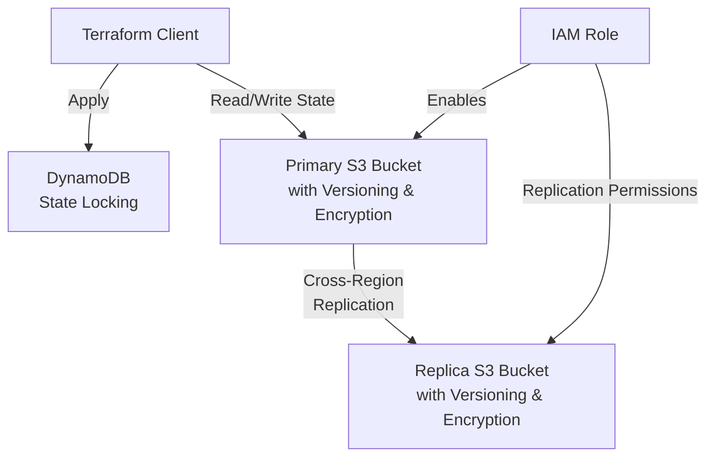

# Terraform S3 Remote Backend Setup

This repository contains Terraform configurations to set up a robust and secure S3 remote backend for Terraform state management with cross-region replication and DynamoDB state locking.

## Features

- ✅ S3 bucket for Terraform state storage
- ✅ Replica S3 bucket for disaster recovery
- ✅ Cross-region replication between buckets
- ✅ DynamoDB table for state locking
- ✅ Server-side encryption for all S3 buckets
- ✅ Strict public access controls
- ✅ Versioning enabled on all buckets
- ✅ IAM role with minimal permissions for replication

## Architecture

The setup consists of:
- Primary S3 bucket for storing Terraform state files
- Secondary S3 bucket in a different AWS region for replication (disaster recovery)
- DynamoDB table for state file locking to prevent concurrent operations
- IAM role and policy for S3 replication
- Security configurations (encryption, public access blocks)

## Prerequisites

- AWS CLI installed and configured
- Terraform (v1.0.0+)
- Appropriate AWS permissions to create the resources

## Project Structure

```
terraform-backend/
├── main.tf           # Main entry point
├── variables.tf      # Variable definitions
├── outputs.tf        # Output definitions
├── providers.tf      # Provider configuration
├── backend.tf        # Backend configuration (initially commented)
├── modules/
│   ├── s3/
│   │   ├── main.tf
│   │   ├── variables.tf
│   │   └── outputs.tf
│   └── dynamodb/
│       ├── main.tf
│       ├── variables.tf
│       └── outputs.tf
└── terraform.tfvars  # Variable values (gitignored)
```

## Setup Instructions

### Step 1: Configure Variables

Create a `terraform.tfvars` file with your specific configuration:

```hcl
aws_region          = "us-east-1"
source_bucket_name  = "your-unique-tf-state-bucket"
replica_bucket_name = "your-unique-tf-state-replica-bucket"
dynamodb_table_name = "terraform-locks"
```

⚠️ Make sure bucket names are globally unique across all AWS accounts.

### Step 2: Initial Infrastructure Creation

Keep the `backend.tf` file commented out for the initial setup:

```bash
# Initialize terraform
terraform init

# Review the plan
terraform plan

# Apply the configuration to create the infrastructure
terraform apply
```

This creates the S3 buckets, DynamoDB table, and replication configuration.

### Step 3: Migrate to S3 Backend

After the infrastructure is created:

1. Uncomment the `backend.tf` file
2. Update the bucket name and region in `backend.tf`:

```hcl
terraform {
  backend "s3" {
    bucket         = "your-unique-tf-state-bucket"  # Replace with your bucket name
    key            = "terraform/state/terraform.tfstate"
    region         = "us-east-1"                    # Replace with your region
    dynamodb_table = "terraform-locks"
    encrypt        = true
  }
}
```

3. Reinitialize Terraform and migrate the state:

```bash
terraform init -migrate-state
```

4. Confirm the migration when prompted

### Step 4: Verify Setup

Verify that your backend is correctly configured:

```bash
# Check S3 bucket
aws s3 ls s3://your-unique-tf-state-bucket/terraform/state/

# Check DynamoDB table
aws dynamodb describe-table --table-name terraform-locks
```

## Using the S3 Backend in Other Terraform Projects

To use this backend in your other Terraform projects, add the following configuration to your `terraform` block:

```hcl
terraform {
  backend "s3" {
    bucket         = "your-unique-tf-state-bucket"
    key            = "path/to/your/project/terraform.tfstate"
    region         = "us-east-1"
    dynamodb_table = "terraform-locks"
    encrypt        = true
  }
}
```

## Best Practices

- 🔒 Don't check in `terraform.tfvars` (add to `.gitignore`)
- 🔑 Use AWS IAM roles/policies to restrict access to the S3 bucket and DynamoDB table
- 📊 Monitor access to the S3 bucket using CloudTrail
- 🔄 Regularly test the disaster recovery process
- 🛡️ Consider enabling MFA Delete for additional protection

## Security Considerations

This setup includes several security features:
- Server-side encryption for S3
- Public access blocking
- Minimal IAM permissions
- State locking to prevent corruption

For enhanced security, consider:
- VPC endpoint for S3 access
- Additional access logging
- Cross-account replication

## Troubleshooting

### Common Issues

1. **S3 bucket doesn't exist error**:
   ```
   Error: error loading state: S3 bucket does not exist.
   ```
   **Solution**: Ensure you've created the bucket before configuring the backend.

2. **Permission denied errors**:
   ```
   Error: AccessDenied: Access Denied
   ```
   **Solution**: Check IAM permissions for the user or role running Terraform.

3. **DynamoDB capacity errors**:
   This setup uses on-demand capacity, so you shouldn't encounter capacity issues.

## Contributing

Please feel free to submit pull requests or open issues to improve this setup.

## License

[MIT](LICENSE)